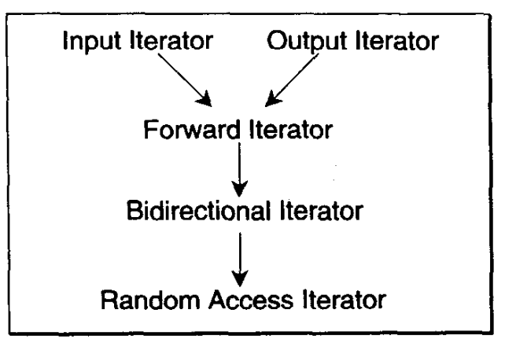
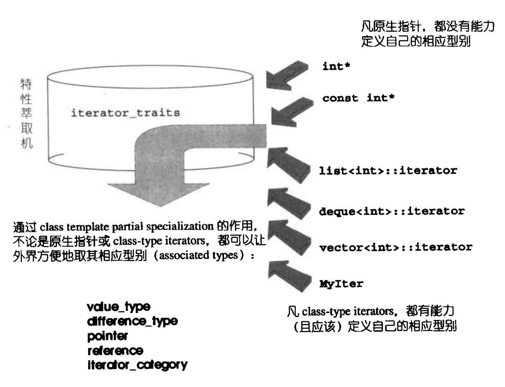

# Iterator

```txt
主要是讲解迭代器
  01-iterator_test.cpp:初识迭代器的作用
  02-iterator_like_smart-pointer.cpp:搭建一个简易迭代器
  03-traits.cpp:特性萃取机
  04-iterator.cpp:iterator标准库代码
  05-__type_traits.cpp:SGI对traits的扩大
```

迭代器的分类

- Input Iterator:不允许被外界改变(只读)
- Output Iterator:只写
- Forward Iterator:允许写入型算法在此迭代器所形成的区间上进行读写操作
- Bidirectional Iterator:可双向移动(例如在list中)
- Random Access Iterator:前四种迭代器都只供应一部分指针算术能力，它支持所有指针算术能力
  - 前三种只有operator++
  - 第四种加上operator--
  - 第五种加上p+n,p-n,p[n],p1-p2,p1<p2 ..

这些迭代器的分类和从属关系：


- 箭头是概念和强化的关系，并非继承关系
- 在设计时，要尽量考虑效率问题，使用最简单的且能胜任的迭代器
- 任何一个迭代器，其类型永远应该落在 该迭代器所隶属的各种类型中最强的那一个
- STL算法的命名规则：
  - 以算法所能接受的最低级迭代器类型，来为其迭代器型别参数命名

## 1. 迭代器的设计思维

**它的中心思想：**将容器和算法分开，彼此独立设计，再通过迭代器将它们粘合起来

## 2. 迭代器是一种 smart pointer

- 迭代器是对象
- 迭代器的行为类似指针
- 迭代器最重要的工作是：重载operator*和operator->

## 3. 型别

- 在使用迭代器的时候可能会用到它的相应型别
- 一般情况下使用template的参数推导机制就可以解决。

## 4. traits编程

- 如果把相应型别作为返回值呢？参数推导机制只能推导参数，不能推导返回值
  - 使用声明内嵌型别可以解决
- 但如果迭代器不是class type呢？它是一个原生指针
  - 使用偏特化来解决(如果class template拥有一个以上的template参数，就可以针对某些个template参数进行特化工作)

每个迭代器都必须遵守约定以内嵌型别定义的方式定义出相应的型别



- traits编程技法大量运用于STL中
- 它利用内嵌型别的编程技巧于编译器的template参数推导功能，增强C++未能提供的关于型别认证方面的能力

最常用到的迭代器相应型别共有五种

### 4.1. value type

它是指迭代器所指对象的型别

### 4.2. difference type

用来表示两个迭代器间的距离，也可以用来表示一个容器的最大容量

- 对于一些连续空间的容器而言，首尾间的距离就是容器的容量
- 在我们需要迭代器的difference type就可以：
  - typename iterator_traits< I>::difference_type

### 4.3. reference type

迭代器：

- 允许改变所指对象的内容：constant iterators
- 不允许改变所指对象的内容：mutable iterators
- 如果要传回左值，应该以by reference的方式进行

### 4.4. pointer type

传回一个pointer，指向迭代器所指之物

### 4.5. iterator_category

- 会引发大规模的写代码工程

### 4.6. advanced()例子

- 它是许多算法内部常用的一个函数，该函数有两参数
  - 迭代器p
  - 数值n
- 函数内部将p累进n次

## 5. __type_traits

- 对traits编程方法的扩展
- STL对迭代器进行规范，制定出iterator_traits
- SGI将它扩展到迭代器之外，制定出__type_traits
  - "__"前缀表明这是SGI内部的东西
  - iterator_traits负责萃取迭代器的特性
  - __type_traits负责萃取型别的特性
  - 型别特性指：
    - 型别是否具备non-trivial defalt ctor
    - 是否具备non-trivial copy ctor
    - 是否具备non-trivial assignment operator
    - 是否具备non-trivial dtor
  - 如果是否定的就在进行构造、析构、拷贝、赋值等操作的时候直接采用最底层的工具，获得做高的效率
- SGI定义的__type_traits提供一种机制：
  - 允许针对不同的型别属性，在编译时期完成函数派送决定
